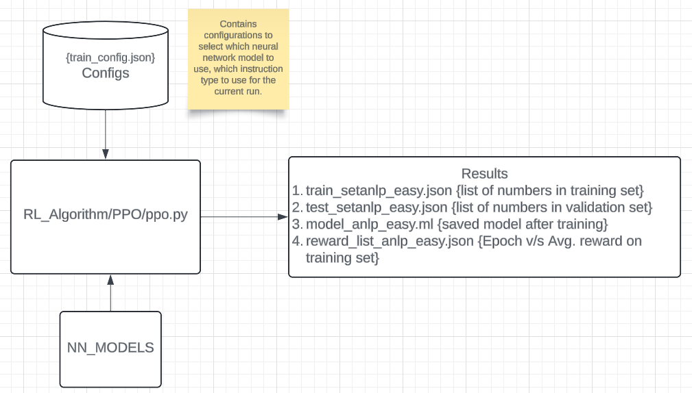
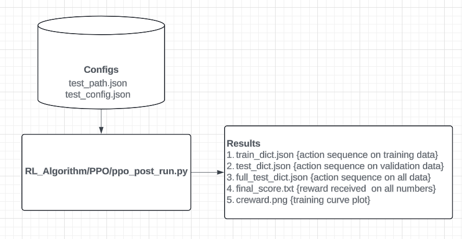

**The Reinforcement Learning Environment**

`Policy type instruction [DEMO]`

---
**Software Architecture**

`During Training`

`During Testing`

---
**How to run the code?**

0. Git clone the project **https://github.com/TheDELLab/NumberLearningInChildren_RL_Language.git** and go inside one directory. Check if you have permission to clone the repository. 
1. Download glove embeddings **wget http://nlp.stanford.edu/data/glove.6B.zip** and unzip it **unzip glove\*.zip**.
2. Pull the environment(docker image) for running the code from docker-hub using. 
   **sudo docker pull tirthankar95/rl-nlp:latest**.
3. Go inside the container **sudo docker run -it -v $(pwd):/NumberLearningInChildren_ML tirthankar95/rl-nlp /bin/bash**
4. Run from the main directory ~ **python3 -W ignore RL_Algorithm/PPO/ppo.py &> Results/console.log &**. This is used to train the model.
5. Run from the main directory ~ **python3 -W ignore RL_Algorithm/PPO/ppo_post_run.py &**. This is used to generate results after the model has been trained.

**Analysis**
1. You can generate your own code for custom analysis. To reproduce our results copy `Results/final_score.txt` and `Results/reward_list_*` to **Analysis** folder. 
2. Rename `final_score.txt` as `console_output_digit{x}_{y}{z1}` and `reward_list_*` as `train_model{y}_d{x}{z2}.txt{a}`

Where,
{a} -> seed_#id
{x} -> no of digits: {1, 2, 3}
{y} -> model number: {0, 1, 2, 3}
{z1}-> {"sate": "_sr", "policy": ""}
{z2}-> {"state": "s", "policy":""}

For example:-
final_score.txt will change to console_output_digit3_3 if 3 digit numbers are present, if the model id is 3 and if instruction type is "policy". 
 
3. Run **python3 Plot_redx.py policy** or **python3 Plot_redx.py state** inside the container based on whether instruction type is `(policy/state)`.