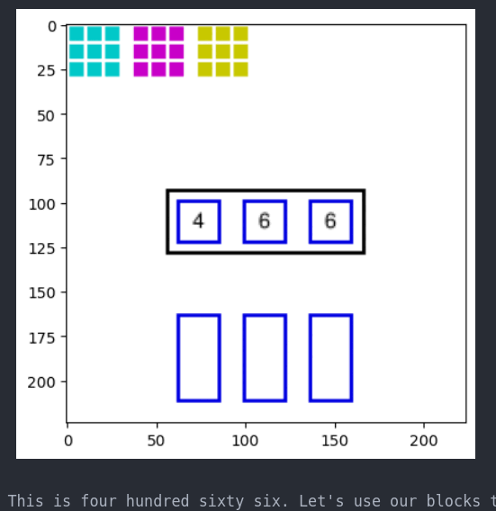
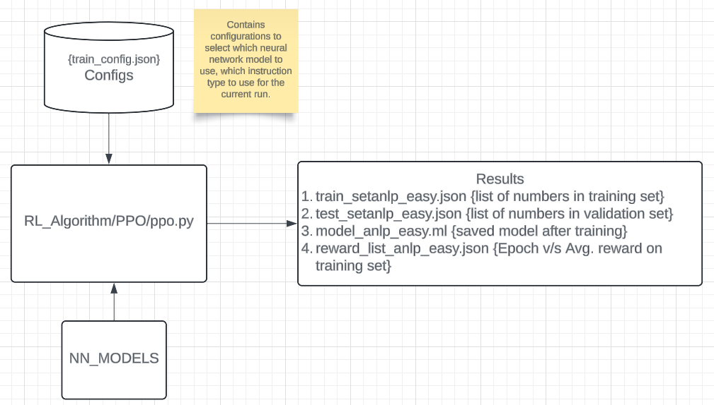
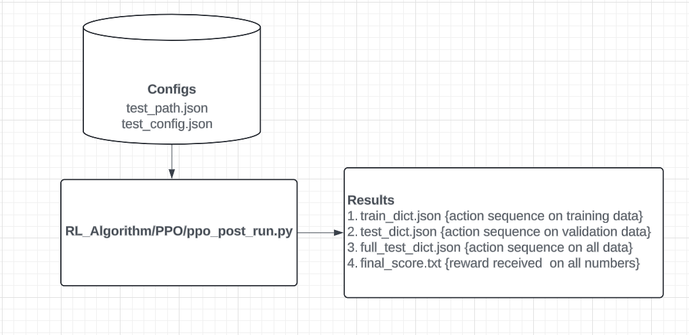

**The Reinforcement Learning Environment**

`Policy type instruction [DEMO]`

---
**Software Architecture**

`During Training`

`During Testing`

---
**How to run the code?**

0. Git clone the project **https://github.com/tirthankar95/NumberLearningInChildren_RL_NLP.git** and go inside one directory. Check if you have permission to clone the repository. 
1. Download glove embeddings **wget http://nlp.stanford.edu/data/glove.6B.zip** and unzip it **unzip glove\*.zip**.
2. Pull the environment(docker image) for running the code from docker-hub using. 
   **sudo docker pull tirthankar95/rl-nlp:latest**.
3. Go inside the container **sudo docker run -it -v $(pwd):/NumberLearningInChildren_ML tirthankar95/rl-nlp /bin/bash**
4. Run from the main directory ~ **python3 -W ignore RL_Algorithm/PPO/ppo.py &> Results/console.log &**. This is used to train the model.
5. Run from the main directory ~ **python3 -W ignore RL_Algorithm/PPO/ppo_post_run.py &**. This is used to generate results after the model has been trained.

**Analysis**
1. You can generate your own code for custom analysis. To reproduce our results copy `Results/final_score_*` and `Results/train_model_*` to **Analysis** folder. 
2. Append {a} to `train_model_*.json{a}` in Analysis folder.
   
   Where,  
   {a} -> {"", "seed_0", "seed_1", ... } depending on whether it's the {1st, 2nd, 3rd, ...} run of the same configuration. 
   <!--{x} -> no of digits: {1, 2, 3}  
   {y} -> model number: {0, 1, 2, 3}  
   {z} -> {"sate": "s", "policy":""}    -->
 
3. Run **python3 Plot_redx.py** inside the container.
4. To create consolidated graphs modify **train_config.json** and **test_config.json**, by trying out all the combinations below.  
`model` $\epsilon$ {0, 1, 2, 3} 
`instr_type` $\epsilon$ {0, 1} 
And then do step 1 & 2, after dumping all the necessary files in the Analysis folder do step 3. This will give consolidated graphs as depicted in the paper.

**`Copyright (c) 2024 Tirthankar Mittra`**